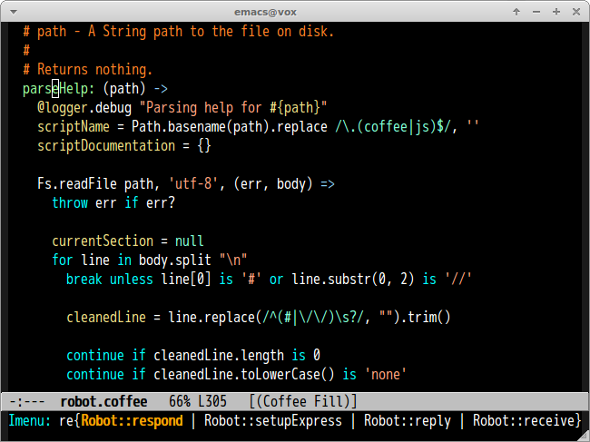

CoffeeScript Major Mode
=======================
[![travis badge][travis-badge]][travis-link] [![melpa badge][melpa-badge]][melpa-link] [![melpa stable badge][melpa-stable-badge]][melpa-stable-link]

An Emacs major mode for [CoffeeScript][cs] and [IcedCoffeeScript][ics].

Provides syntax highlighting, indentation support, imenu support,
a menu bar, and a few cute commands.




## Requirement

- Emacs 24.1 or higher
- CoffeeScript 1.9.3 or higher


## Installation via package.el

`coffee-mode` is available on [MELPA][melpa] and [MELPA-STABLE][melpa-stable].

You can install `coffee-mode` with the following command.

<kbd>M-x package-install [RET] coffee-mode [RET]</kbd>

**Please do not install [GNU Emacs Lisp Package Archive][elpa] version.**

It's too old and many features(Block string, block comment etc) are not implemented.

## Whitespace

`coffee-mode` used to offer automatic deletion of trailing whitespace.
This is now left to `whitespace-mode`. See its documentation for full
details, but as a hint, configure:

```lisp
;; automatically clean up bad whitespace
(setq whitespace-action '(auto-cleanup))
;; only show bad whitespace
(setq whitespace-style '(trailing space-before-tab indentation empty space-after-tab))
```

Then turn on `whitespace-mode`, or `global-whitespace-mode`.


## Indentation

To set the number of spaces used with each additional indentation, add this to your `.emacs` or
`init.el` or other initialization file:

```lisp
;; This gives you a tab of 2 spaces
(custom-set-variables '(coffee-tab-width 2))
```

`coffee-tab-width` is buffer local variable. You can set indentation size
per buffer by using `File Variables`.

```coffee
# Local variables:
# coffee-tab-width: 4
# End:
```

### Using TAB

Set `coffee-indent-tabs-mode` t if you want to use **TAB** instead of spaces.


### Move to corresponding point in JavaScript file after compiling

You can archive this with [sourcemap](https://github.com/syohex/emacs-sourcemap) and
following configuration.

You can install `sourcemap` package from [MELPA][melpa].

```lisp
;; generating sourcemap by '-m' option. And you must set '--no-header' option
(setq coffee-args-compile '("-c" "--no-header" "-m"))
(add-hook 'coffee-after-compile-hook 'sourcemap-goto-corresponding-point)

;; If you want to remove sourcemap file after jumping corresponding point
(defun my/coffee-after-compile-hook (props)
  (sourcemap-goto-corresponding-point props)
  (delete-file (plist-get props :sourcemap)))
(add-hook 'coffee-after-compile-hook 'my/coffee-after-compile-hook)
```

## imenu

If you're using imenu, `coffee-mode` should work just fine. This
means users of [textmate.el][tm] will find that `⇧⌘T`
(`textmate-go-to-symbol`) mostly works as expected.

If you're not using imenu check out [this page][im] or textmate.el for
a really awesome way to jump quickly to a function's definition in a
file.

## Default Key Bindings

| Key                  | Command                                 |
|:---------------------|:----------------------------------------|
| `C-m`, `Return`      | Insert newline and indent line          |
| `C-c C-<`, `backtab` | Indent line or region to left           |
| `C-c C->`            | Indent line or region to right          |
| `C-M-a`              | Move to beginning of defun              |
| `C-M-e`              | Move to end of defun                    |
| `C-M-h`              | Mark this defun                         |
| `A-r`, `C-c C-k`     | Compile buffer to JavaScript            |
| `A-R`                | Compile content of region to JavaScript |
| `A-M-r`, `C-c C-z`   | Run CoffeeScript REPL                   |
| `C-c C-l`            | Send this line to REPL buffer           |
| `C-c C-r`            | Send content of region to REPL buffer   |
| `C-c C-b`            | Send content of buffer to REPL buffer   |
| `C-c C-o C-s`        | Enable coffee-cos-mode                  |

`C-m` and `Return` key insert newline and indentation. If you don't want indentation please overwrite it as below.

``` emacs-lisp
(define-key coffee-mode-map (kbd "C-m") 'newline)
```


## Commands

### easymenu

If you have `easymenu` you can get to any of these commands from the
menu bar:


### coffee-repl

Launch a CoffeeScript REPL

### coffee-compile-file

Compile buffer to JavaScript.

### coffee-compile-buffer

Compile region to JavaScript

### coffee-watch

Run `coffee` with the `--watch` flag on a directory or file.

### coffee-cos-mode

Minor mode for compiling to JavaScript at save file.

### coffee-live-compile-mode

Minor mode for compiling buffer in real time.


## Customization

### Indent like python-mode

When `coffee-indent-like-python-mode` is non-nil, indent command works like `python-mode`.
I suppose that [Evil](https://bitbucket.org/lyro/evil/wiki/Home)'s `o` and `O` commands
works as you expect with this option.

```lisp
(custom-set-variables
 '(coffee-indent-like-python-mode t))
```

## Sample Configuration

```lisp
;; coffeescript
(custom-set-variables
 '(coffee-tab-width 2)
 '(coffee-args-compile '("-c" "--no-header" "--bare")))

(eval-after-load "coffee-mode"
  '(progn
     (define-key coffee-mode-map [(meta r)] 'coffee-compile-buffer)
     (define-key coffee-mode-map (kbd "C-j") 'coffee-newline-and-indent)))
```


## Bugs

Please file bugs at <https://github.com/defunkt/coffee-mode/issues>

[cs]: http://jashkenas.github.com/coffee-script/
[ics]: http://maxtaco.github.com/coffee-script/
[tm]: https://github.com/defunkt/textmate.el
[im]: http://chopmo.blogspot.com/2008/09/quickly-jumping-to-symbols.html
[elpa]: https://elpa.gnu.org/
[melpa]: https://melpa.org/
[melpa-stable]: https://stable.melpa.org/
[travis-badge]: https://travis-ci.org/syohex/coffee-mode.svg
[travis-link]: https://travis-ci.org/syohex/coffee-mode
[melpa-link]: https://melpa.org/#/coffee-mode
[melpa-stable-link]: https://stable.melpa.org/#/coffee-mode
[melpa-badge]: https://melpa.org/packages/coffee-mode-badge.svg
[melpa-stable-badge]: https://stable.melpa.org/packages/coffee-mode-badge.svg
